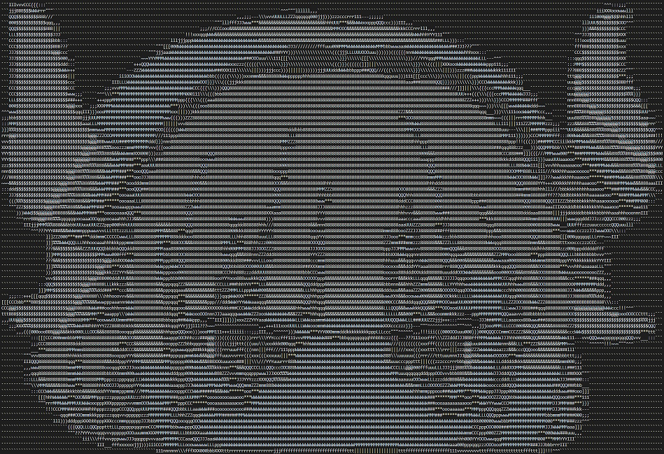

# PFAB
My Samples for [Programming Projects for Advanced Beginners](https://robertheaton.com/2018/12/08/programming-projects-for-advanced-beginners/) in C++.

## #1: ASCII art
This was pretty straightforward except for installing and getting [Magick++](https://imagemagick.org/Magick++/) to work on a windows machine. 

Sample Image: 

ASCII version:

